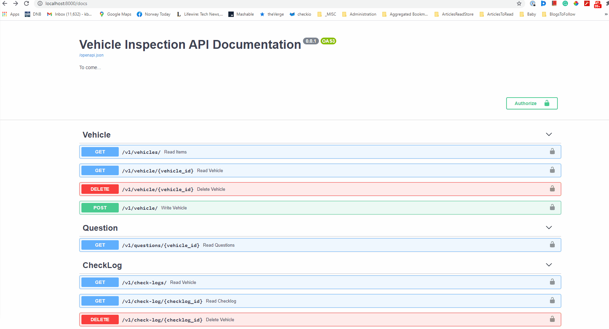
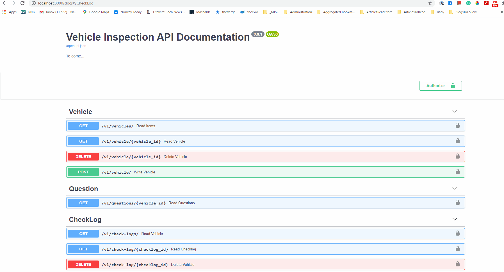
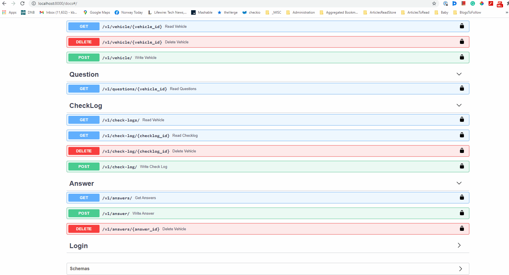
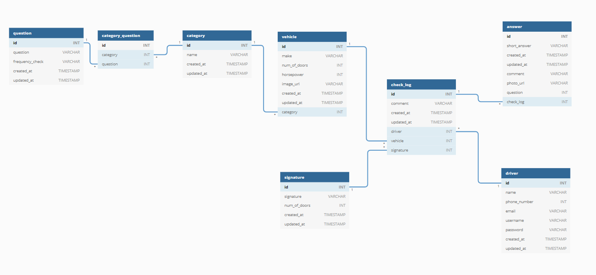

<!-- PROJECT SHIELDS -->
<!--
*** I'm using markdown "reference style" links for readability.
*** Reference links are enclosed in brackets [ ] instead of parentheses ( ).
*** See the bottom of this document for the declaration of the reference variables
*** for contributors-url, forks-url, etc. This is an optional, concise syntax you may use.
*** https://www.markdownguide.org/basic-syntax/#reference-style-links
-->
<!-- [![Contributors][contributors-shield]][contributors-url]
[![Forks][forks-shield]][forks-url]
[![Stargazers][stars-shield]][stars-url]
[![Issues][issues-shield]][issues-url]
[![MIT License][license-shield]][license-url]
[![LinkedIn][linkedin-shield]][linkedin-url] -->


<!-- PROJECT LOGO -->
<br />
<p align="center">
  <a href="https://github.com/baky0905/rental-inspection-api">
    
  </a>

  <h3 align="center">Vehicle Rental Inspection Data Modelling and REST API </h3>

  <p align="center">
    More info.
    <br />
    <a href="https://github.com/baky0905/rental-inspection-api"><strong>Explore the docs »</strong></a>
    <br />
    <br />
    <a href="./">View Demo</a>
    ·
    <a href="https://github.com/baky0905/rental-inspection-api/issues">Report Bug</a>
    ·
    <a href="https://github.com/baky0905/rental-inspection-api/issues">Request Feature</a>
  </p>
</p>


- [Entity Relationshop Diagram (ERD)](#entity-relationshop-diagram-erd)
  - [Backend Requirements](#backend-requirements)
  - [Backend local development](#backend-local-development)
  - [Backend local development, additional details](#backend-local-development-additional-details)
    - [General workflow](#general-workflow)
  - [Getting Started](#getting-started)
  - [Project Structure](#project-structure)
  - [Available REST API endpoints](#available-rest-api-endpoints)
  - [Roadmap](#roadmap)
  - [License](#license)
  - [Contact](#contact)


## About The Project

This project is an attempt to develop a backend for an potential front-end vehicle inspection web applictaion (web application will not be a part of this project):
  - Model the data into a relational datamodel
  - Implement the data model into a PostgreSQL relational database with an initial data tables needed for the web application to function 
  - Develop data REST API using Python and FastAPI on top of the PostgreSQL database that will enable relevant CRUD operations for the vehicle inspection application. 

End result can be visualised and tested via API documentation locally when the stack is running (more info later on)



All API endpoints need a JWT token based to be accessed. There is one dummy
user that has privilages to be authorized.



Example of crud operation where in the inspection process, user could answer
the inspection question, i.e. example of CRUD operations.



# Entity Relationshop Diagram (ERD)




## Backend Requirements

* [Docker](https://www.docker.com/).
* [Docker Compose](https://docs.docker.com/compose/install/).

## Backend local development

* Start the stack with Docker Compose:

```bash
docker-compose up -d
```

- Now you can open your browser and interact with these URLs:

Backend, JSON based web API based on OpenAPI: http://localhost:8000/openapi.json

Automatic interactive documentation with Swagger UI (from the OpenAPI backend): http://localhost:8000/docs

Alternative automatic documentation with ReDoc (from the OpenAPI backend): http://localhost:8000/redoc

PGAdmin, PostgreSQL web administration: http://localhost:5050/browser/

  - login: 
    - username: admin@example.com
      - password: admin
  - database password: 1234


To check the logs, run:

```bash
docker-compose logs
```

To check the logs of a specific service, add the name of the service, e.g.:

```bash
docker-compose logs server
```

If your Docker is not running in `localhost` (the URLs above wouldn't work) check the sections below on **Development with Docker Toolbox** and **Development with a custom IP**.

**Note**: The first time you start your stack, it might take a minute for it to be ready. While the backend waits for the database to be ready and configures everything. You can check the logs to monitor it.


## Backend local development, additional details

### General workflow

<!-- GETTING STARTED -->
## Getting Started

This is an example of how you may give instructions on setting up your project locally.
To get a local copy up and running follow these simple example steps.

By default, the dependencies are managed with requirements.txt and pip.


Next, open your editor at `./backend/app/` (instead of the project root: `./`), so that you see an `./app/` directory with your code inside. That way, your editor will be able to find all the imports, etc. Make sure your editor uses the environment you just created.

```console
$ docker-compose up -d
```

and then `exec` inside the running container:

```console
$ docker-compose exec server bash
```

You should see an output like:

```console
root@7f2607af31c3:/app#
```


## Project Structure

```
.
├── README.md
├── backend
│   ├── Dockerfile
│   ├── __init__.py
│   ├── app
│   │   ├── __init__.py
│   │   ├── crud.py
│   │   ├── database.py
│   │   ├── load.py
│   │   ├── main.py
│   │   ├── models.py
│   │   ├── routes
│   │   ├   └──v1.py
│   │   ├── schemas.py
│   │   └── utils
│   ├── entrypoint.sh
│   ├── requirements.txt
│   └── venv
├── db_init
│   ├── __init__.py
│   ├── data
│   │   ├── answer.csv
│   │   ├── category.csv
│   │   ├── category_question.csv
│   │   ├── check_log.csv
│   │   ├── driver.csv
│   │   ├── question.csv
│   │   ├── signature.csv
│   │   └── vehicle.csv
│   ├── db-drop-create-load-csvs.py
│   └── sql_queries
│       ├── create-tables.sql
│       ├── drop-tables.sql
│       ├── example_query.sql
│       └── sql_queries.py
├── docker-compose.yml
├── img
└── servers.json
```

## Available REST API endpoints

<!-- ROADMAP -->
## Roadmap

See the [open issues](https://github.com/baky0905/rental-inspection-api/issues) for a list of proposed features (and known issues).

To do:


<!-- LICENSE -->
## License

Distributed under the MIT License. See `LICENSE` for more information.


## Contact

Kristijan Bakaric - [twitter.com/kbakaric1](https://twitter.com/kbakaric1) 

Project Link: [https://github.com/baky0905/rental-inspection-api](https://github.com/baky0905/rental-inspection-api)


