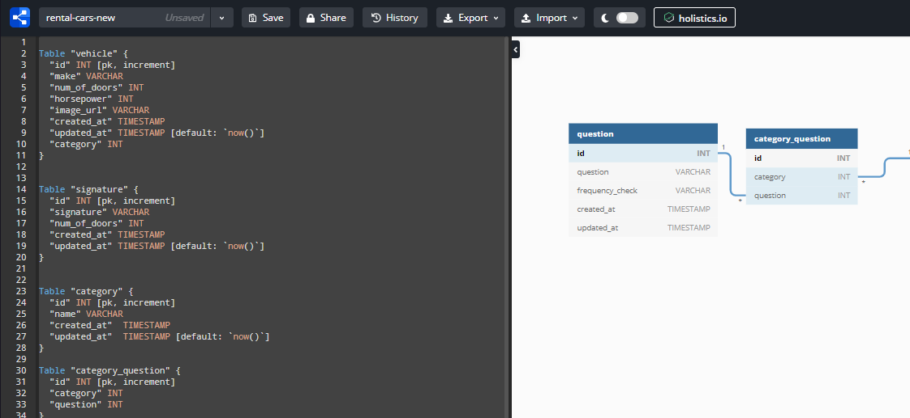
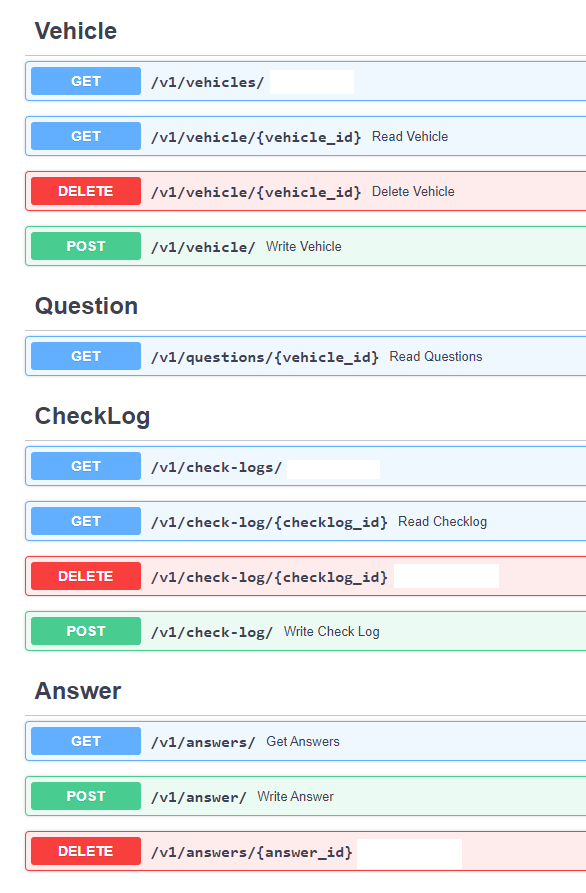

<br />
<p align="center">

  <h3 align="center">Vehicle Rental Inspection Data Modelling and REST API </h3>

  <p align="center">
    More info.
    <br />
    <a href="https://github.com/baky0905/rental-inspection-api"><strong>Explore the docs »</strong></a>
    <br />
    <br />
    <a href="./">View Demo</a>
    ·
    <a href="https://github.com/baky0905/rental-inspection-api/issues">Report Bug</a>
    ·
    <a href="https://github.com/baky0905/rental-inspection-api/issues">Request Feature</a>
  </p>
</p>


- [About The Project](#about-the-project)
- [Backend Requirements](#backend-requirements)
- [Backend local development](#backend-local-development)
- [Backend local development, additional details](#backend-local-development-additional-details)
  - [General workflow](#general-workflow)
- [Getting Started](#getting-started)
- [Project Structure](#project-structure)
- [Entity Relationshop Diagram (ERD)](#entity-relationshop-diagram-erd)
- [Initialization of the Database](#initialization-of-the-database)
- [Available REST API endpoints](#available-rest-api-endpoints)
- [Roadmap](#roadmap)
- [License](#license)
- [Contact](#contact)


## About The Project

This project is an attempt to develop a backend for vehicle inspection web applictaion (web application will not be a part of this project). Project included tasks as follows:
  - Data modelling of the vehicle inspection domain
  - Implement the data model into a PostgreSQL relational database with an initial data tables needed for the web application to function 
  - Develop data REST API using Python and FastAPI on top of the PostgreSQL database that will enable relevant CRUD operations for the vehicle inspection application. 

End result can be visualised and tested via API documentation locally when the stack is running (more info later on)


All API endpoints need a JWT token based to be accessed. There is one dummy
user that has privilages to be authorized.


Example of crud operation where in the inspection process, user could answer
the inspection question, i.e. example of CRUD operations.


## Backend Requirements

**I am developing in WSL2, Ubuntu 20.04 using Visual Studio Code**

* [Docker](https://www.docker.com/).
* [Docker Compose](https://docs.docker.com/compose/install/).

## Backend local development

* Start the stack with Docker Compose:

```bash
docker-compose up -d
```

- Now you can open your browser and interact with these URLs:

Backend, JSON based web API based on OpenAPI: http://localhost:8000/openapi.json

Automatic interactive documentation with Swagger UI (from the OpenAPI backend): http://localhost:8000/docs

Alternative automatic documentation with ReDoc (from the OpenAPI backend): http://localhost:8000/redoc

PGAdmin, PostgreSQL web administration: http://localhost:5050/browser/

  - login: 
    - username: admin@example.com
      - password: admin
  - database password: 1234

Since it is only a development app, .env with all the passwords and secrets has been included in version control. Do not do that if you are forking the project :)

To check the logs, run:

```bash
docker-compose logs
```

To check the logs of a specific service, add the name of the service, e.g.:

```bash
docker-compose logs server
```

If your Docker is not running in `localhost` (the URLs above wouldn't work) check the sections below on **Development with Docker Toolbox** and **Development with a custom IP**.

**Note**: The first time you start your stack, it might take a minute for it to be ready. While the backend waits for the database to be ready and configures everything. You can check the logs to monitor it.


## Backend local development, additional details

### General workflow

<!-- GETTING STARTED -->
## Getting Started

This is an example of how you may give instructions on setting up your project locally.
To get a local copy up and running follow these simple example steps.

By default, the dependencies are managed with requirements.txt and pip.


Next, open your editor at `./backend/app/` (instead of the project root: `./`), so that you see an `./app/` directory with your code inside. That way, your editor will be able to find all the imports, etc. Make sure your editor uses the environment you just created.

```console
$ docker-compose up -d
```

and then `exec` inside the running container:

```console
$ docker-compose exec server bash
```

You should see an output like:

```console
root@7f2607af31c3:/app#
```


## Project Structure

```
.
├── README.md
├── backend
│   ├── Dockerfile
│   ├── __init__.py
│   ├── app
│   │   ├── __init__.py
│   │   ├── crud.py
│   │   ├── database.py
│   │   ├── load.py
│   │   ├── main.py
│   │   ├── models.py
│   │   ├── routes
│   │   ├   └──v1.py
│   │   ├── schemas.py
│   │   └── utils
│   ├── entrypoint.sh
│   ├── requirements.txt
│   └── venv
├── db_init
│   ├── __init__.py
│   ├── data
│   │   ├── answer.csv
│   │   ├── category.csv
│   │   ├── category_question.csv
│   │   ├── check_log.csv
│   │   ├── driver.csv
│   │   ├── question.csv
│   │   ├── signature.csv
│   │   └── vehicle.csv
│   ├── db-drop-create-load-csvs.py
│   └── sql_queries
│       ├── create-tables.sql
│       ├── drop-tables.sql
│       ├── example_query.sql
│       └── sql_queries.py
├── docker-compose.yml
├── img
└── servers.json
```


- `database.py`
  - imports sqlalchemy part and engine, SessionLocal and Base as declarative_base()
- `models.py`
  - Creates SQLAlchemy models from the Base class
  - These classes are the SQLAlchemy models.
  - The __tablename__ attribute tells SQLAlchemy the name of the table to use in the database for each of these models.
  - Create model attributes/columns
  - Create the relationships via relationship provided by SQLAlchemy ORM. 
- `schemas.py`
  - These Pydantic models define more or less a "schema" (a valid data shape).
- `crud.py`
  - In this file we will have reusable functions to interact with the data in the database.
  - CRUD comes from: Create, Read, Update, and Delete.
- `routes/v1.py`
  - contains all the api endpoints for the api version1
- `main.py`
  - integrates and uses all the other parts from above
  - contains middleware with login endpoints, all endpoints require jwt token
- `utils/security.py`
  - authentication and jwt token creation and verification related functions.
## Entity Relationshop Diagram (ERD)


ERD has been designed in [https://dbdiagram.io/](https://dbdiagram.io/), and I highly recommend it. Schema can be found in the [local folder](./db_init/erd/erd_dbdiagram.txt), and diagramm can be easily reconstructed from it via the website.




## Initialization of the Database

Create a virtual environment while in ./backend folder.

Run following command:
```bash
python3 -m venv venv
```

and to activate the env:


```bash
python3 venv/bin/activate
```

Install packages from requirements.txt with pip3:

```bash
pip3 install -r requirements.txt
```

Finally run a python script `db-drop-create-load-csvs.py` located in db_init folder:

```bash
python3 db_init/db-drop-create-load-csvs.py 
```

The `db-drop-create-load-csvs.py` script will do the following:

- **drop all tables** in postgres database - [script](./backend/db_init/sql_queries/sql_queries.py)
- **create all tables** in postgres database - [script](./backend/db_init/sql_queries/sql_queries.py)
- populate the created tables with dat located in [data_init folder](./backend/db_init/)


## Available REST API endpoints



<!-- ROADMAP -->
## Roadmap

See the [open issues](https://github.com/baky0905/rental-inspection-api/issues) for a list of proposed features (and known issues).

To do:


<!-- LICENSE -->
## License

Distributed under the MIT License. See `LICENSE` for more information.


## Contact

Kristijan Bakaric - [twitter.com/kbakaric1](https://twitter.com/kbakaric1) 

Project Link: [https://github.com/baky0905/rental-inspection-api](https://github.com/baky0905/rental-inspection-api)


